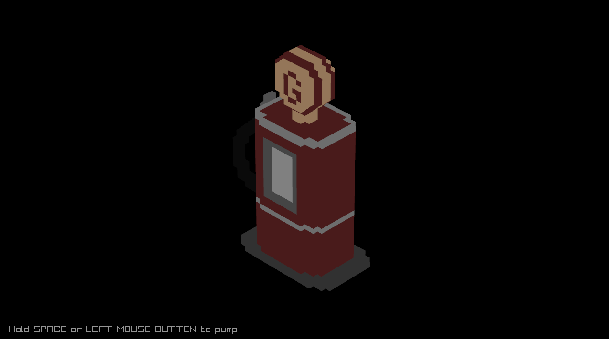
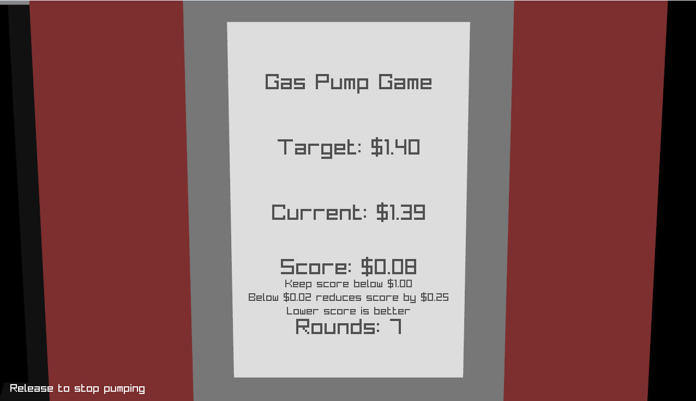

# Stop the Pump

A simple game made in about 3 hours with Raylib and C.

We challenged ourselves to get a game mostly completed in the time with the constraint of having a single control for the input.

## Description

You're betting your friends that you can stop the pump at an exact number. Get within $0.02 to lower your par score, otherwise your score goes up by the difference you missed by. Accumulate over $1.00 in score and lose the game. Survive as many rounds as you can!

### Features

- Simple 3D model and camera animation
- Single-control gameplay

## Controls

Keyboard:

- Hold space to begin filling and release to release the pump trigger

Mouse:

- Hold left mouse button to begin filling and release to release the pump trigger

## Screenshots

Overview

Gameplay

## Developers

- Brian Maher - Graphics, UI, and polish
  - [Website](https://brianpmaher.com)
  - [Github](https://github.com/brianpmaher)

- Kyle Reynolds - Gameplay
  - [Github](https://github.com/KDreynolds)
  - [X](https://x.com/imYerf)

## Building

This project requires CMake and a C compiler.

You also need to have [raylib](https://github.com/raysan5/raylib) installed as a sibling to the parent directory of this project. Feel free to change that path in the CMakeLists.txt if you have it installed elsewhere.

It's only been tested on Windows and macOS.

You also need some luck.

## License

This game sources are licensed under an unmodified zlib/libpng license, which is an OSI-certified, BSD-like license that allows static linking with closed source software. Check [LICENSE](LICENSE) for further details.
